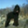

# 🚀 VGG Example

This example trains a simple model (simplified from the VGG architecture) 
on the GPU. The dataset used is CIFAR 10. 
We want to train the model to discriminate between 2 labels 
(not the 10 available): the 8 (ships) against the 5 (dogs).

Here is a subset of images we find for the label 8 (ships) vs label 5 (dogs).

<table align="center" cellspacing="0" cellpadding="0">
    <tr>
        <td></td>
        <td></td>
        <td></td>
        <td></td>
        <td> </td>
        <td></td>
        <td></td>
        <td></td>
        <td></td>
    </tr>
    <tr>
        <td></td>
        <td></td>
        <td></td>
        <td></td>
        <td> </td>
        <td></td>
        <td></td>
        <td></td>
        <td></td>
    </tr>
    <tr>
        <td></td>
        <td></td>
        <td></td>
        <td></td>
        <td> </td>
        <td></td>
        <td></td>
        <td></td>
        <td></td>
    </tr>
    <tr>
        <td></td>
        <td></td>
        <td></td>
        <td></td>
        <td> </td>
        <td></td>
        <td></td>
        <td></td>
        <td></td>
    </tr>
</table>

## Setup

This example has some `Python` dependencies. In order to run 
the example, we first have to setup the environment: 

```bash
conda create --name maexamples python=3.7
conda activate maexamples
cd Tests/MAExamples/Base
pip install -e .
```

Now, let us run the tests from Xcode or a `bash` command (here with compiler 
optimization):

```bash
swift test -c release --filter MAExamples
```

It is finally possible to clean the environment 🌍

```bash     
conda deactivate
conda env remove --name maexamples
```

## Known Issues

The following error may follow on local setup: 
`UnpicklingError: invalid load key, ‘v’`.

This may occur when lfs data files are not pulled. 
To fix this: 

```bash     
git lfs pull
```

## Steps

1. Dump the training and testing datasets.
1. Dump some images corresponding to the 2 labels 
   we want to discriminate against.
1. Evaluate a random model on the testing dataset: watch a bad performance.  
1. Train a model on the training dataset.
1. Evaluate the trained model on the testing dataset: 
   watch a better performance.
