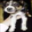

# 🚀 Vision Transformer Example

This is the documentation of a [toy Vision Transformer model](../../Tests/GrAIExamples/VisionTransformer.swift), 
trained on the GPU. 
The dataset used is CIFAR 10. 

We want to train the model to discriminate between 2 labels 
(not the 10 available of the CIFAR 10 dataset): the 8 (ships) or the 5 (dogs).

Here is a subset of images we find for the label 8 (ships) vs label 5 (dogs).

<table align="center" cellspacing="0" cellpadding="0">
    <tr>
        <td></td>
        <td></td>
        <td></td>
        <td></td>
        <td> </td>
        <td></td>
        <td></td>
        <td></td>
        <td></td>
    </tr>
    <tr>
        <td></td>
        <td></td>
        <td></td>
        <td></td>
        <td> </td>
        <td></td>
        <td></td>
        <td></td>
        <td></td>
    </tr>
    <tr>
        <td></td>
        <td></td>
        <td></td>
        <td></td>
        <td> </td>
        <td></td>
        <td></td>
        <td></td>
        <td></td>
    </tr>
    <tr>
        <td></td>
        <td></td>
        <td></td>
        <td></td>
        <td> </td>
        <td></td>
        <td></td>
        <td></td>
        <td></td>
    </tr>
</table>

## Setup

This example has some `Python` dependencies. In order to run 
the example, we first have to setup the environment: 

```bash
conda create --name graiexamples python=3.9
conda activate graiexamples
cd Tests/GrAIExamples/Base
pip install -e .
```

Now, let us run the tests from Xcode or a `bash` command (here with compiler 
optimization):

```bash
swift test -c release --filter GrAIExamples
```

It is finally possible to clean the environment 🌍

```bash     
conda deactivate
conda env remove --name graiexamples
```

## Steps

1. Dump the training dataset.  
1. Train a simple Vision Transformer model on the training dataset.
